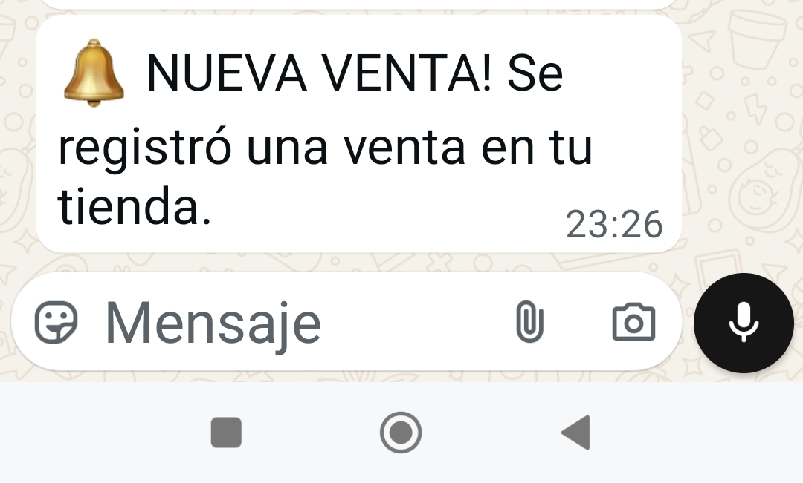

# 📊 Demo – Notificador de Ventas Mercado Libre → WhatsApp

---
## 1️⃣ Paso 1 – Venta confirmada en Mercado Libre

👉 Cuando entra una orden pagada en Mercado Libre, el robot la detecta automáticamente.
---
## 2️⃣ Paso 2 – Notificación instantánea en WhatsApp

👉 En segundos, el comerciante recibe un WhatsApp con los datos del pedido.
---
