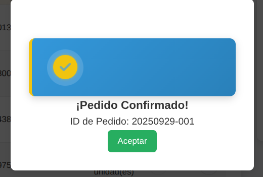

# 📊 Demo – Notificador de Ventas desde Google Sheets / Excel → WhatsApp

---

## 1️⃣ Paso 1 – Nueva fila añadida en la planilla

👉 Algunos negocios llevan sus ventas directamente en una **hoja de cálculo** (Google Sheets o Excel compartido).  
Cada vez que un vendedor carga una nueva fila con producto, monto y cliente, n8n detecta automáticamente ese cambio.

---

## 2️⃣ Paso 2 – Notificación instantánea en WhatsApp

👉 Apenas se detecta la nueva fila, el comerciante recibe un WhatsApp con:  
- Producto: Lámpara LED  
- Monto: $6.500  
- Cliente: Carlos Gómez  

---

## ✅ Resultado
El sistema convierte una simple hoja de cálculo en una herramienta automática:  
Cada nueva venta en la planilla se **notifica al instante en el celular del comerciante**, sin que tenga que revisar manualmente los datos.
